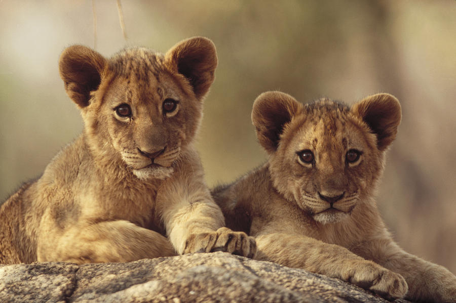

# Brief description of lions

Lions are majestic, social big cats found in grasslands and savannas of Africa and parts of Asia. Known for their distinctive manes, males are larger and play a vital role in protecting prides. Females are skilled hunters, working together to catch prey. Lions are apex predators, symbolizing strength and courage. They communicate through roars, establishing territorial dominance. Despite their powerful and regal appearance, lions face conservation challenges, as their populations are threatened by habitat loss and human-wildlife conflict.

