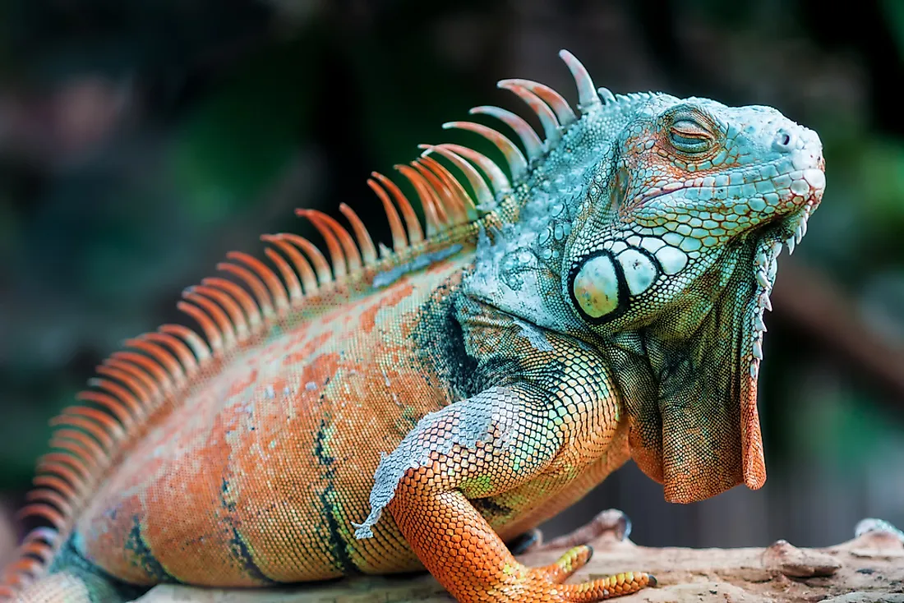

# Lizards

Lizards are a diverse group of reptiles characterized by their scaly skin, elongated bodies, and typically four legs. They exhibit a wide range of sizes, colors, and habitats, from tiny geckos to large monitor lizards. Lizards are cold-blooded, relying on external sources of heat to regulate their body temperature. Many species are skilled climbers, while others are adapted to burrowing or aquatic lifestyles. They play crucial roles in ecosystems as both predators and prey. Some, like chameleons, are known for their ability to change color, adding to the fascinating diversity within the lizard family.

